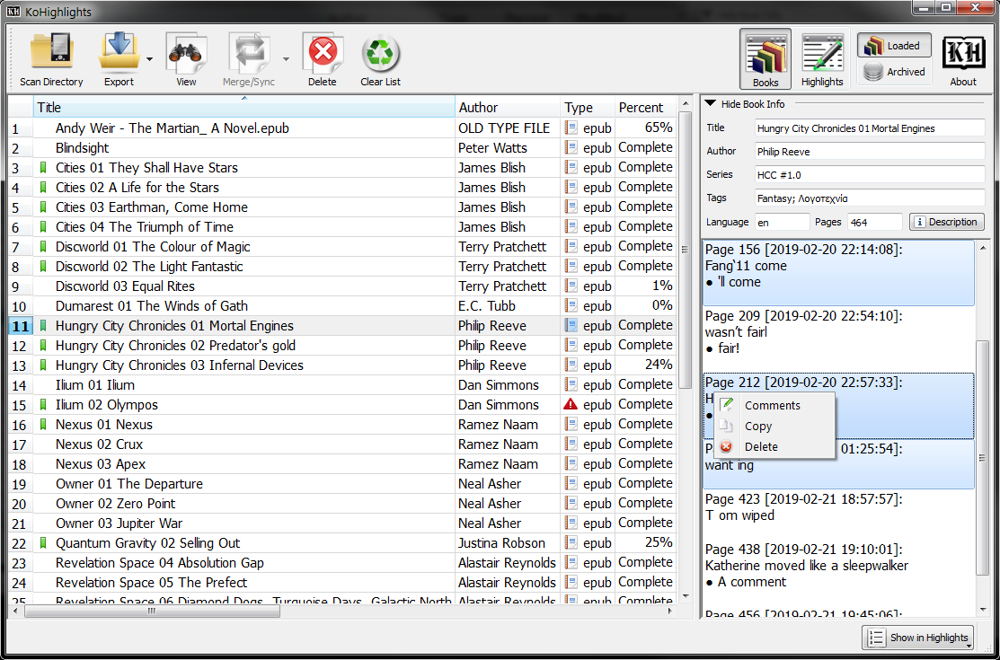
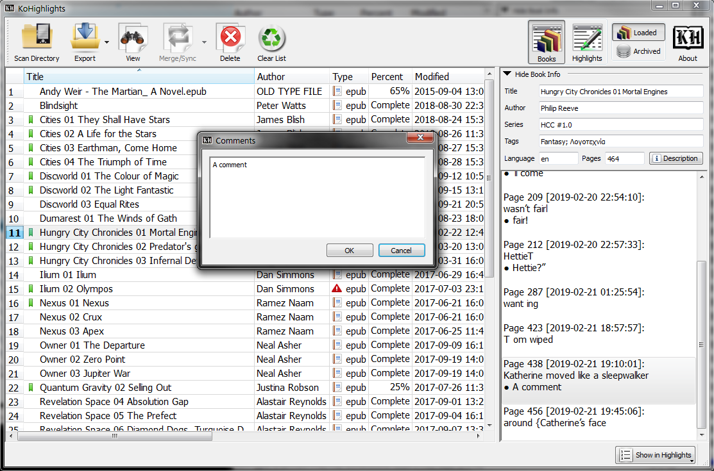
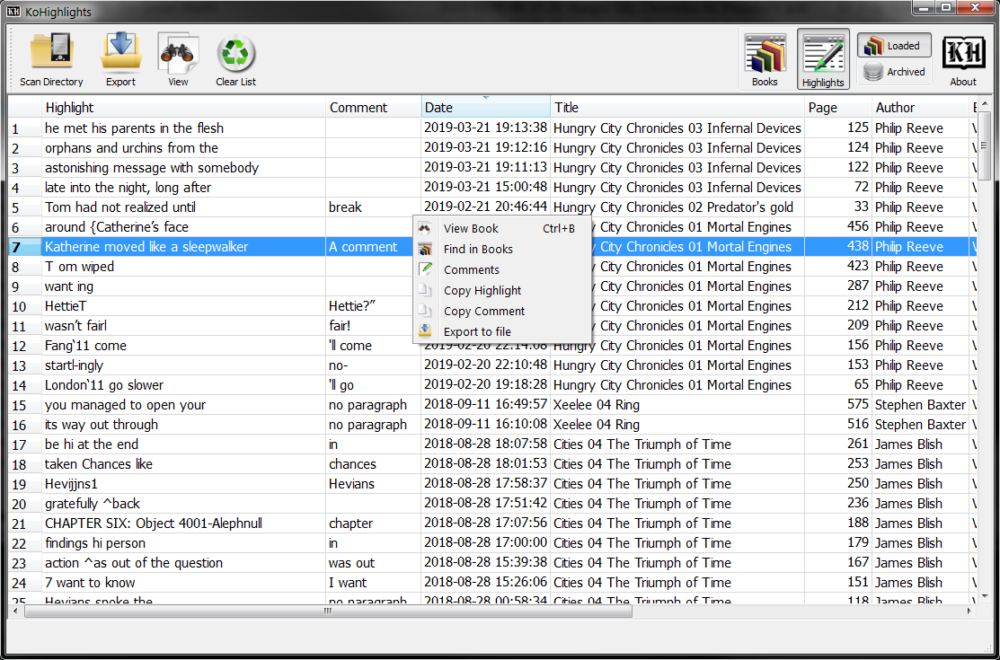

## General

**KOHighlights** is a utility for viewing and exporting [Koreader](https://github.com/koreader/koreader)'s highlights to text, html, csv, or markdown files. 
This repository is a fork of the original project at [KOHighlights](https://github.com/noembryo/KoHighlights); the purpose of this fork is to promote better inter-operability with personal knowledge management software, such as [Logseq](https://logseq.com/) and [Obsidian](https://obsidian.md/). 

### Screenshots

  
  
  

## Usage
* Load items by:
    * Selecting the reader's drive or any folder that contains books that where opened with Koreader. This will automatically load all the metadata files from all subdirectories.
    * Drag and drop files or folders. This will load the files and/or all the files inside the folders.  
* Export the highlights of the selected books to individual files or to one merged file.
* Supported formats for exporting:
    * Plain text files (.txt)
    * Hypertext document files (.html)
    * Comma-separated values files (.csv)
    * Markdown files (.md)
* View the highlights and various info for a book by selecting it in the list.
* Save the highlights to the "Archive" and view them, even if your reader is not connected.
* Merge highlights/Sync position from the same book that is read in two different devices and/or sync its reading position. To do it you have to:
    * Load both metadata (e.g. by scanning your reader's _and_ your tablet's books).
    * Select the relevant rows of the (same) book.
    * If the book has the same cre_dom_version (version of the CREngine), then the "Merge/Sync" button gets activated and you get the options to sync the highlights or the position or both.
* Merge highlights/Sync position of a book with its archived version
  (book's right click menu) 
* Show/hide the page, date, chapter or even the highlight text while viewing or saving the highlights of the books. 
* Double click or press the Open Book button to view the book in your system's reader.
* Delete some or all the highlights of any book.
* Clear/reset the .sdr folders with the metadata or the books in the eReader.

### Prerequisites
* Progress sync plugin must be enabled in KOReader

## Dependencies
This project uses [poetry](https://python-poetry.org/) for Python dependency management. See the [pyproject.toml](pyproject.toml) for detailed dependency information.

### Linux
On a Debian-compatible system, these packages are sufficient: `libxcb-cursor0`, `libxcb-xkb1`, `libxcb-icccm4`, `libxcb-keysyms1`, `libxkbcommon-x11-0`.

### Portable
In Windows, KOHighlights can run in Portable mode using a `portable_settings` directory to store its settings, that is located inside the installation directory of the app.  
Because of this, it is advised to not install the app inside the `Program Files` folder if you indent to use it as portable.  
There are two ways to start the app in Portable mode:
* Run the `KoHighlights Portable.exe` that is located next to the `KoHighlights.exe`.  
* Run `KoHighlights.exe` with a `-p` argument.  
E.g. create a shortcut for the `KoHighlights.exe` and add a space and a `-p` argument at the end of the target filename.

## Extra
KOHighlights includes SLPPU (a converter between python and lua objects). 
If you want it to be globally available, get it from its
[GitHub's page](https://github.com/noembryo/slppu) or install it with:  
`pip install git+https://github.com/noembryo/slppu`  